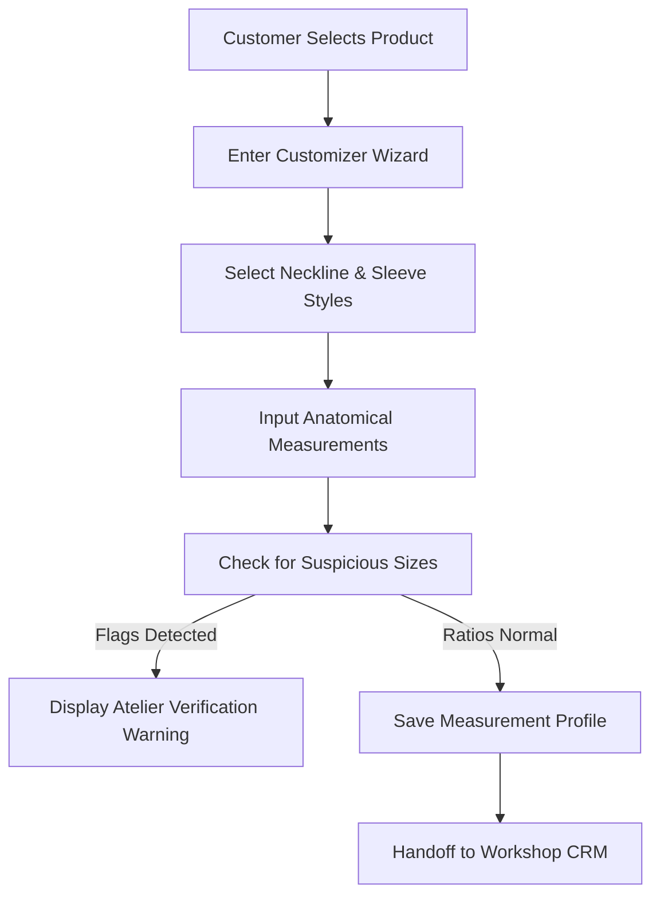

# Operational Workflows

This document outlines the core business workflows driving the Deeprastore custom tailoring, fit validation, and communication concierge pipeline.

---

## 1. Custom Stitching & Sizing Funnel

---

## 2. Atelier & Sizing CRM Pipeline
Work is tracked dynamically through four stages on the tailoring Kanban board:
1.  **Cutting**: Master Cutter validates sizing specs, checks history for previous alteration notes, drafts the pattern on canvas, and cuts the fabric.
2.  **Stitching**: Hand-tailoring and sewing teams execute assembly, ensuring high-stress seam integrity and extra seam margins.
3.  **Embroidery**: Artisans (Karigars) add handcrafted elements, zari work, or zardozi details.
4.  **QC (Quality Control)**: Verification specialists match the stitched garment against original spec cards on custom mannequins.

---

## 3. Workshop Handoff & Concierge Flows
- **WhatsApp Ticket Handoff**: The CRM auto-generates structured text summaries (containing styles, measurements, and special instructions) for instant copy-paste communication or webhook dispatch to the workshop manager.
- **Suspicious Size Flags**: If a profile violates expected anatomical ratios (e.g., `Bust <= Waist`), the system tags the item as `[SUSPICIOUS SIZING DETECTED]` with direct tooltips for the workshop team to verify with the customer before cutting fabric.
